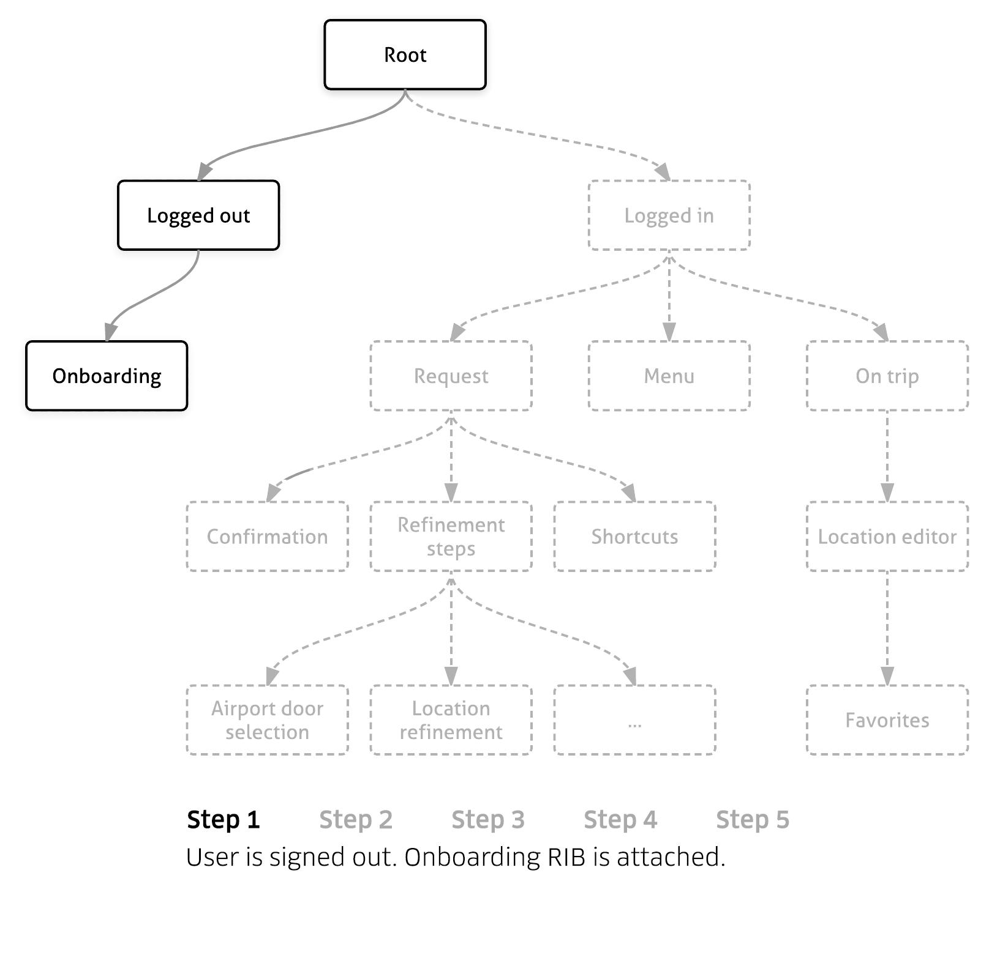

# flutter_ribs

A port of uber/ribs, a novel approach to app architecture which places business logic, deep linking, a/b testing, and codebase stability as first class citizens.

## Introduction

So, a couple years ago, Uber decided to do a major refactor of their mobile apps, and decided to structure their state tree based on business logic instead of view logic. This created a novel approach to mobile app architecture that I believe is worth studying, which is why I ported it to Flutter.

At first the approach seems odd, if we build our app as a view logic tree, why would we instead try to structure it as a business logic tree? And what the heck do they mean by business logic? As a term, it can be quite nebulous.

## Business Logic Tree

The business logic tree is made up of customer states. Are they logged in, or not? Based on that state, what can they do, and how do they transition towards the goal of being a paying customer?

Each cell above is a `rib`, and not all of them have a view.

At first glance, this may appear to be a view logic tree, and my suspicion is that well architected apps tend to have a view logic tree that closely matches the business logic tree. But structuring the tree with business logic first creates some unique properties.

### Static analysis from top to bottom

Since `ribs` architecture makes use of dependency injection, inheritance, and builder pattern, we are given very strong static analysis of the entire codebase from top to bottom. Compare this to using `context` to pass services through the widget tree, a common practice in Flutter, where the order of the components is always statically correct but can break an app. The justification of this is to allow for easy refactoring, something that is extremely rare in `ribs` architecture.

### Refactoring your business, not your views

Any time you refactor an app built on the `ribs` architecture, it seems that you are fundamentally refactoring the business logic and therefore the business itself. It's rare to refactor a business, so the codebase should remain fairly stable. If you're looking to update a view, that isn't really a refactor in `ribs.` See below.

### A/B testing, not refactoring

If you want to update a view, you just create a copy of an existing `rib` with a view and modify the view. Since the new rib conforms to the same interface as the old one, it is fully interchangeable and the business logic of the app never changed. This new rib/view can be enabled via flags for A/B testing, incremental migration, or even providing alternative views for different markets.

### Deep linking tied to business logic

Typically deep linking would throw you into a certain view. Deep linking with `ribs` is different. You use a Workflow to progress down the tree, which allows you to do things like create dormant deeplinks that will wait for the customer to end up in a certain customer state before firing off an in-app event. Imagine creating a deeplink that causes the app to wait for someone to be looking for a ride before offering them a coupon, instead of just sending them to a page of a coupon.

## Contributing

This framework *should* be usable today, since it conforms to all of the uber/ribs Swift test coverage, but it is not battle tested. Feel free to play around with it, make issues, and feel free to make PRs. My goal is to use this framework for research, but ideally the community will move it towards being production ready.

This framework does currently depend on Flutter but if someone wants to make it work outside the Flutter framework I would be happy to accept discuss options in the issues. I'm not sure if this framework would work well for backend applications but I'd be curious to see what backend devs think, and if they believe there is merit, I would happily work with them to make this a pure Dart package.